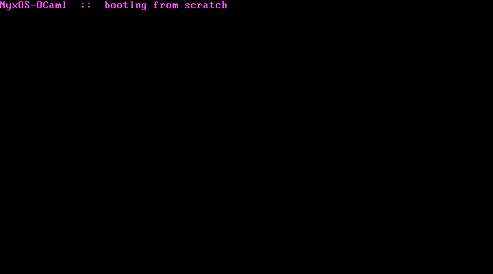

<div align="center">
  
</div>

<p align="center"><strong>NyxOS, rebuilt from scratch in OCaml — a freestanding 64-bit kernel that boots on bare metal</strong></p>

<p align="center">
  
  &nbsp;
  
  &nbsp;
  
  &nbsp;
  <a href="https://github.com/nyxos-dev/nyx-os"></a>
</p>

---

## About

Part of the **[NyxOS](https://github.com/nyxos-dev/nyx-os) family** — the same OS, rebuilt from zero in a different language each time. This is the **OCaml** cut, compiled with the native **`ocamlopt`**.

OCaml is garbage-collected with a heavy multicore runtime, so running it with *no* runtime is the whole trick. The kernel never allocates — the string operations are compiler primitives and the loops only ever *poll* the collector. `ocamlopt` inserts those polls as `young_ptr > young_limit` checks against the domain state, so a tiny boot stub (`ocaml_boot.s`) sets up just enough of that state — `young_limit = 0` and a C-call stack — and keeps `young_ptr` above it, so every poll passes and `caml_call_gc` is never reached. The whole runtime is then three C functions: the VGA store, `caml_initialize`, and a halting stub. The compiled OCaml module runs straight on the metal.

<div align="center">
  
  <p><em>NyxOS-OCaml booting in QEMU (GRUB → long mode → ocamlopt native code) on the VGA text buffer</em></p>
</div>

**Why OCaml:** it powers **MirageOS**, which compiles whole operating systems into a single OCaml program — so a bare-metal OCaml kernel is very much in the family tradition.

## Build & run

Needs `ocamlopt`, `gcc`, `nasm`, `ld`, `grub-mkrescue` + `xorriso`, and `qemu`.

```bash
make        # -> nyxos-ocaml.iso  (64-bit ELF booted via GRUB)
make run    # boot the ISO in QEMU
```

Because the kernel is a 64-bit ELF, it boots from a **GRUB ISO** (`qemu -cdrom`) rather than `qemu -kernel`.

## Layout

- `kernel.ml` — the freestanding OCaml kernel; paints the banner via an external VGA store
- `ocaml_boot.s` — sets up OCaml's `r14`/`r15` (domain state / young_ptr) and calls the module entry
- `octrt.c` — the three-function runtime shim (`vga_store`, `caml_initialize`, `caml_call_gc`)
- `boot64.asm` — Multiboot header + the 32-bit → long-mode trampoline that calls `kmain`
- `linker64.ld` — links the 64-bit kernel at 1 MiB, Multiboot header first
- `grub.cfg` / `Makefile` — ISO packaging and boot

## Status

Early — it boots and paints the screen. Next up: a GDT/IDT, interrupts, and a VGA console.
